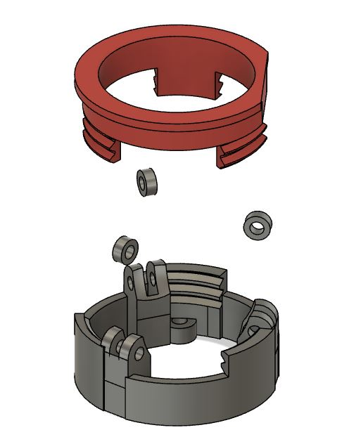

# Trackball holder

Assembly made to hold a 35mm trackball.

- Uses a PMW3360 sensor PCB.
- Can be integrated into other keyboards
- Easy to assemble and repair if necessary

## Material list

Bearing MR63-3x6x2.5mm

| Item  | Amount | Notes |
| ------------- | ------------- | ------------- |
| Bearing   | 3  | MR63-3x6x2.5mm  |
| M3 screw 8mm | 3  | Torx, tapered  |
| M3 screw 8mm | 2  | Torx, tapered - For the sensor PCB  |
| M3 screw insert | 2  |   |

## How to use

In your keyboard, add a ring of 21mm radius, 2mm height.

Screw in from the top and bottom.

# License

This work is licensed under a Creative Commons Attribution-NonCommercial-ShareAlike 4.0 International License.